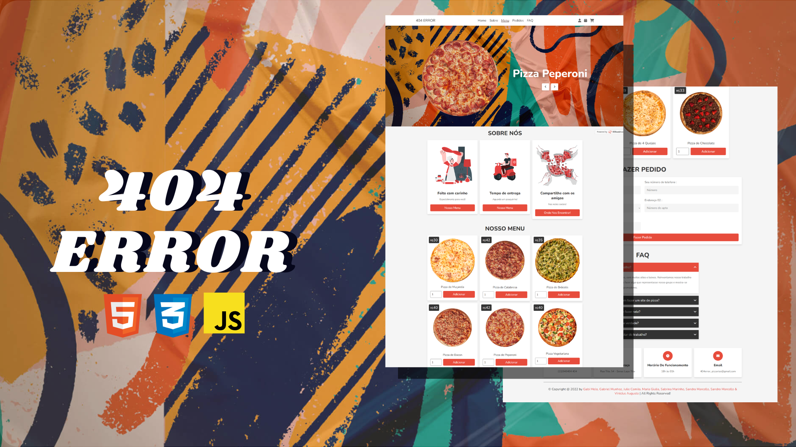
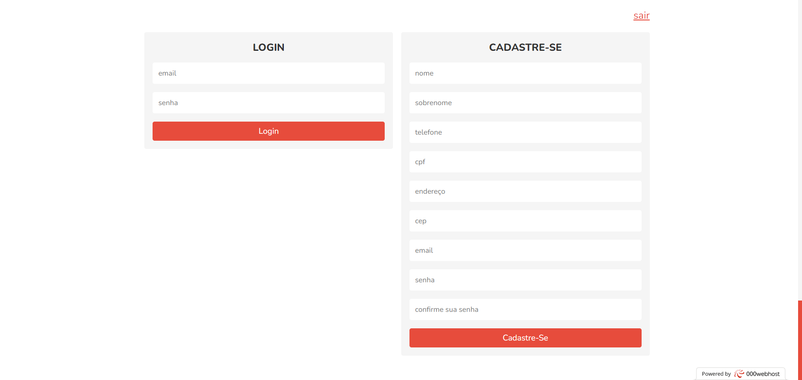
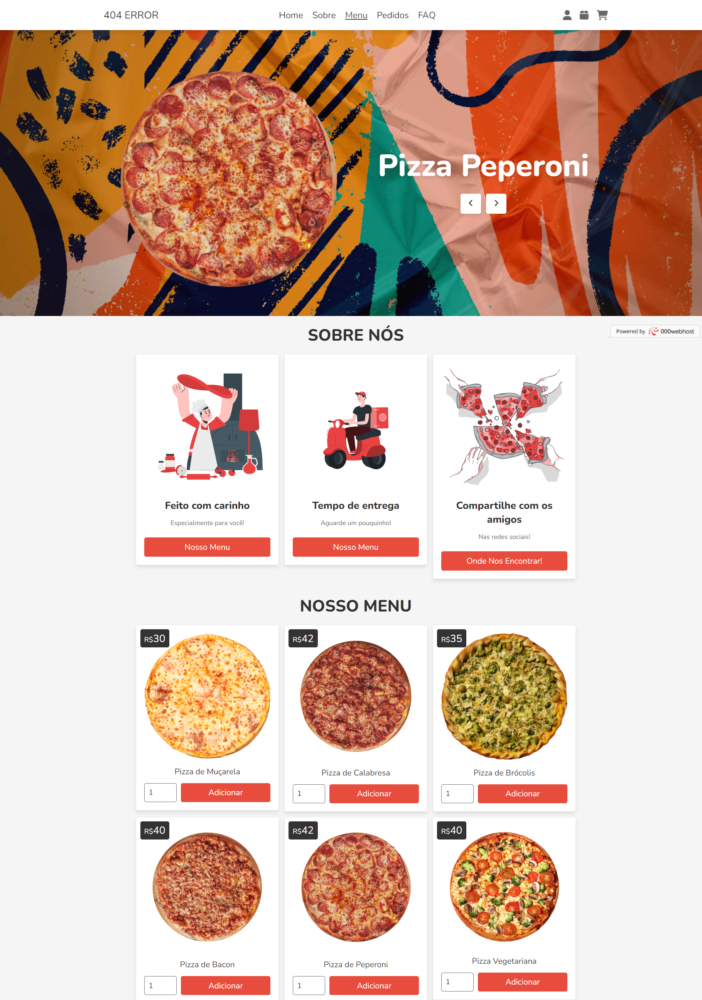
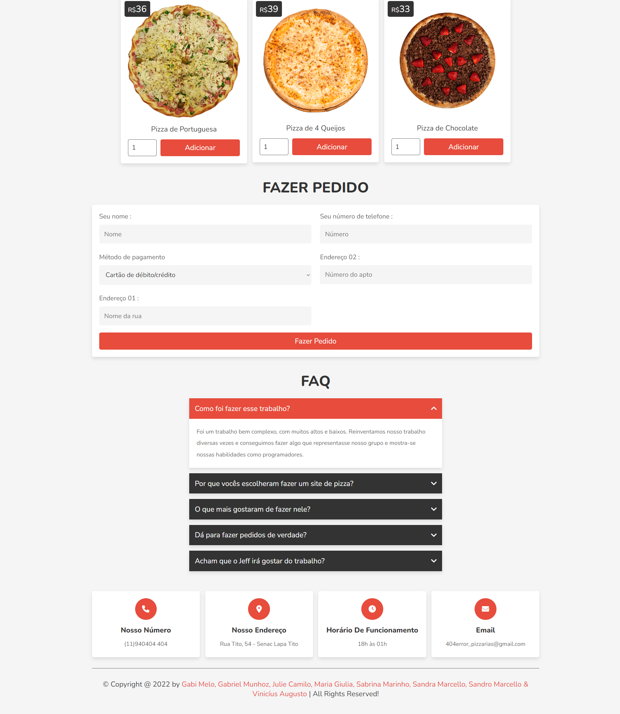
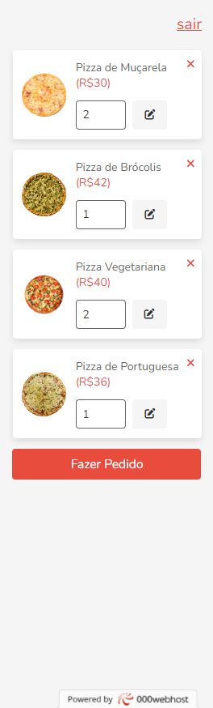
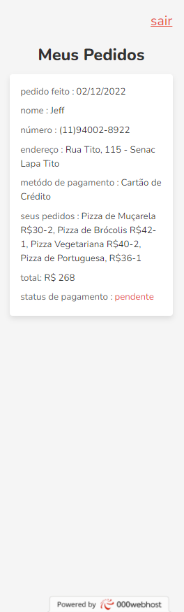

<h1 align="center"> 404 ERROR </h1>



O 404 ERROR é um site de pizzaria responsivo desenvolvido como projeto final do curso técnico de tecnologia da informação pelo Senac.


## Sumário do Projeto

* [Introdução](#introdução)
* [Funcionalidades do Projeto](#funcionalidades-do-projeto)
* [Layout](#layout)
* [Tecnologias Utilizadas](#tecnologias-utilizadas)
* [Como Executar](#como-executar)


# Introdução
A ideia do site 404 ERROR surgiu a partir da necessidade de testar e aprimorar os meus conhecimentos e dos meus colegas de grupo. O 404 ERROR é um site de pizzaria responsivo criado em 4 linguagens diferentes para o projeto final do curso técnico de tecnologia da informação.

# Funcionalidades do Projeto

- [x] Formulário de Cadastro do Usuário
 - [x] Formulário de Cadastro de Endereço
 - [x] Formulário de Login
 - [x] Cardápio do Restaurante
 - [x] Fazer Pedido
 - [x] Slideshow de Imagens
 - [x] Exibição de Detalhes de Pedidos
 - [x] Seção de Perguntas Frequentes (FAQ)
- [x] Rodapé com Informações de Contato e Direitos Autorais
- [x] Uso de Estilos CSS
- [x] Uso de Scripts JavaScript

# Layout







<br>

# Tecnologias Utilizadas
- HTML: Linguagem de Marcação usada para a estruturação do site

- [CSS](https://www.css3.com): Linguagem de estilo usada para estilizar o site

- [PHP](https://www.php.net): Linguagem de Programação utilizada para o banco de dados com as informações do cliente (como endereço e email) e os pedidos feitos

- Javascript: Linguagem de Programação usada para maior interatividade com o usuário, como: As imagens que podem ser mudadas com a setinhas nas laterais, no começo do site. Assim como o abrir e fechar dos ícones do carrinho ou usuário
# Como Executar

```
1. Instale o Xampp na sua máquina, por meio do link abaixo 

2. Faça um clone desse repositório na sua máquina:

3. Se certificar de que haja uma pasta para receber esse arquivo, no "htdocs" do "xampp" localizado no disco local do computador;

4 . Abra o git bash ou terminal dentro dessa pasta
- Copie a URL do repositório
- Digite git clone <URL copiada> e pressione enter

5. (opcional) Ter instalada a extensão "Open PHP/HTML/JS In Browser";

6 . Acesse o arquivo pelo VSCODE, e se certifique de que o "APACHE" do Xampp esteja ligado e funcionando corretamente;

7. Logo após isso, clique no código com o botão direito e clique em "Open PHP/HTML/JS In Browser" (De acordo com sua configuração, o navegador indicado na extensão será aberto e o código será aberto);
```

### - Link para baixar o [XAMPP](https://www.apachefriends.org/pt_br/index.html) 


